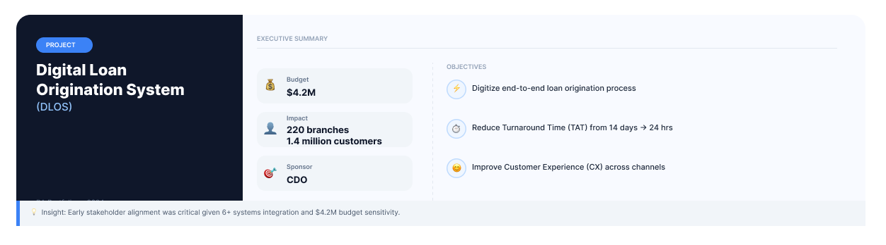
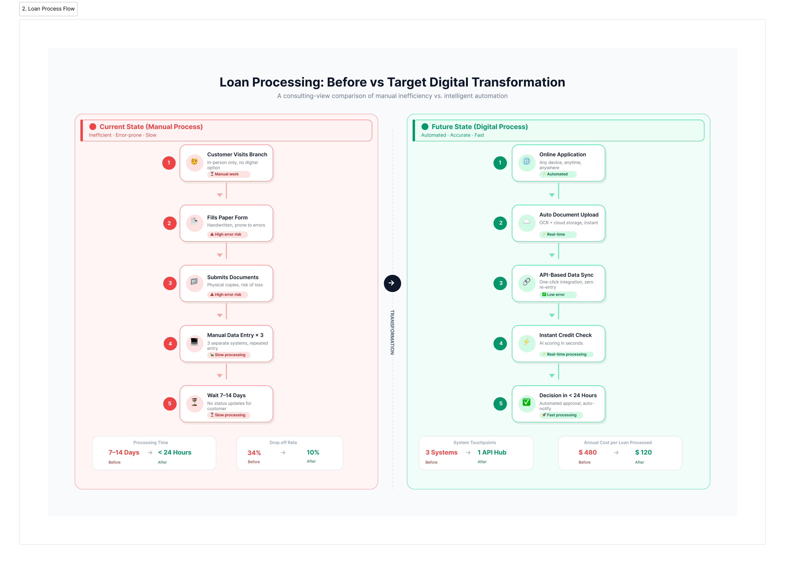
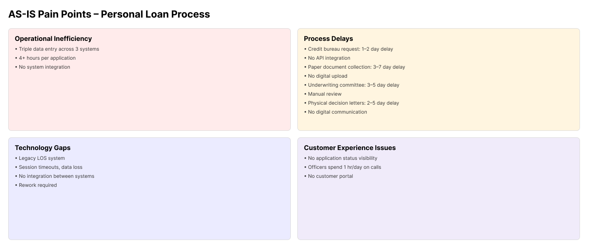
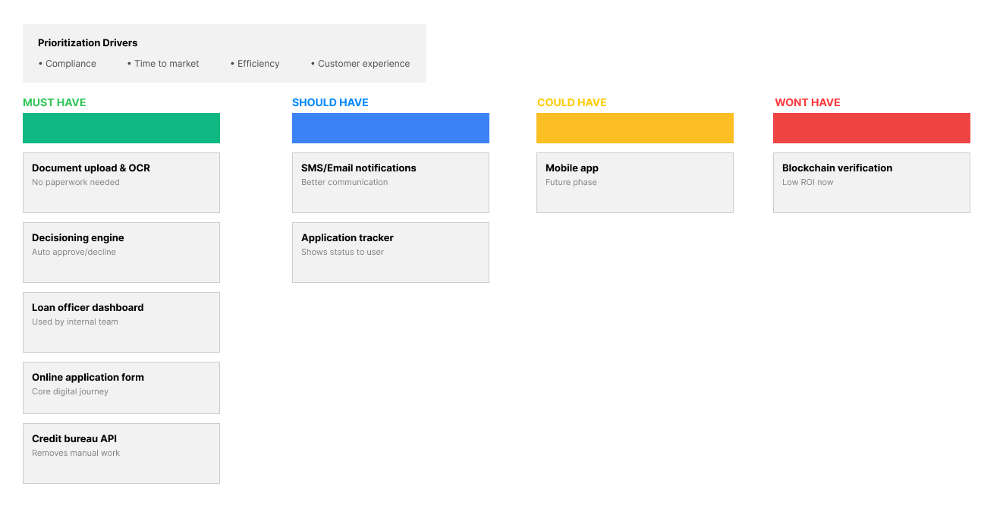
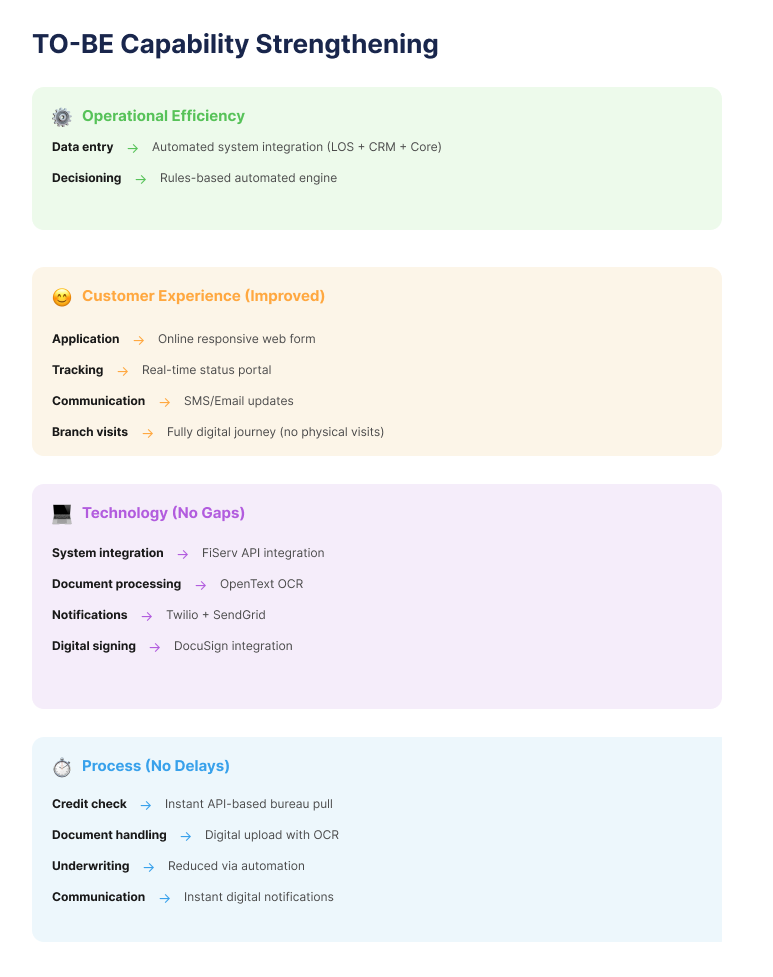
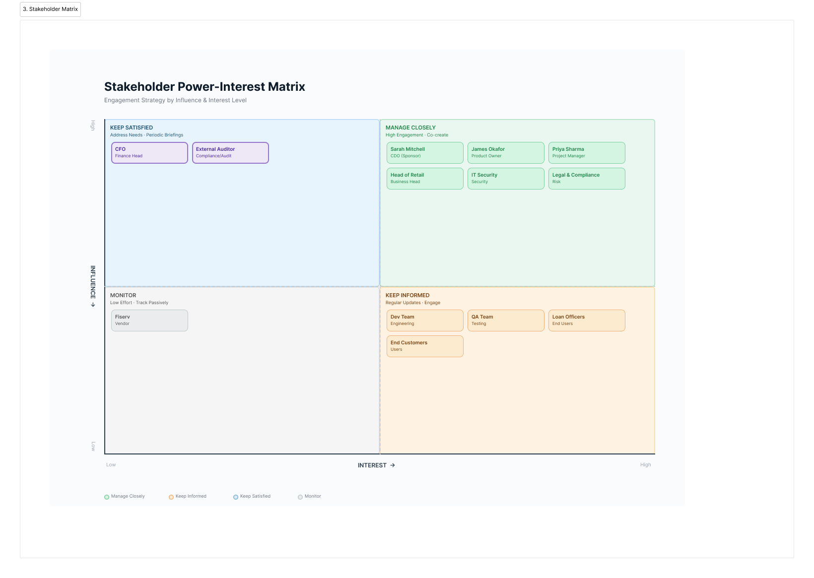
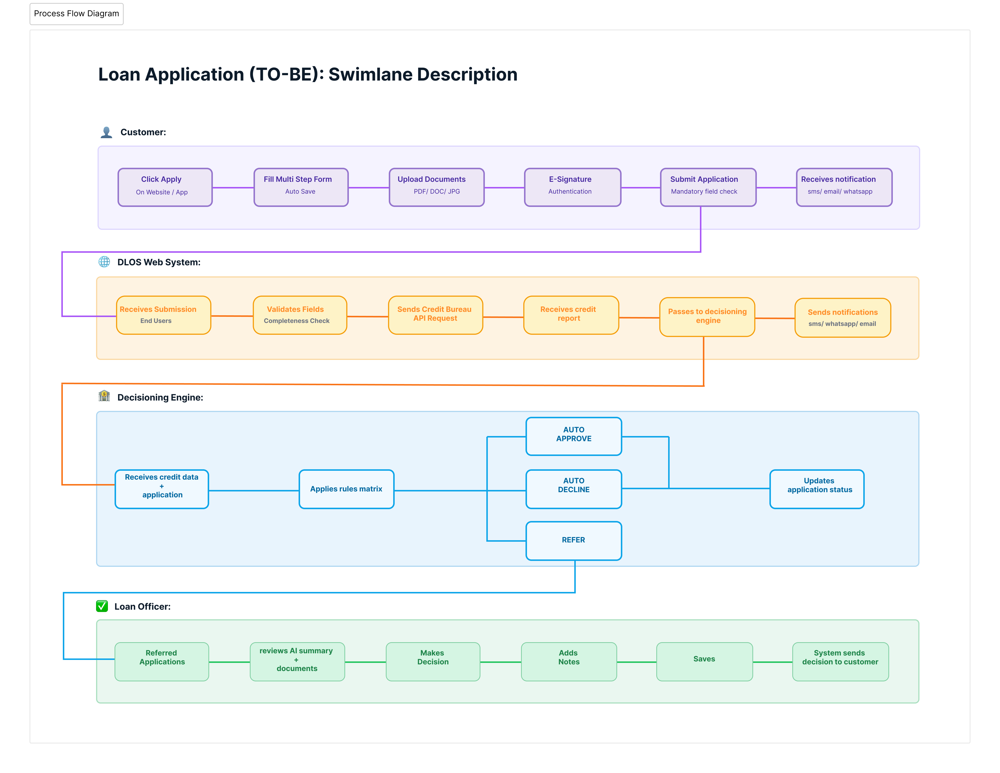
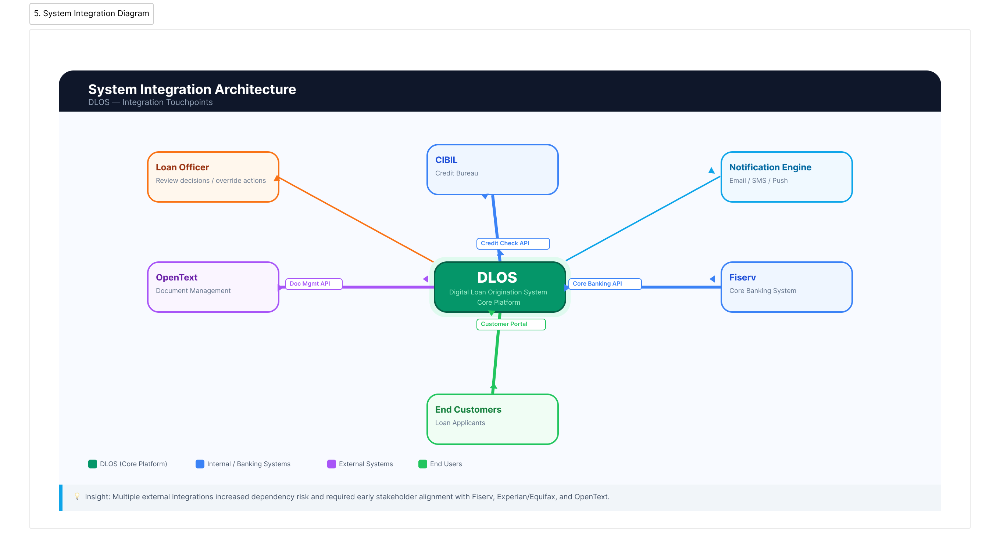

# 🚀 Horizon National Bank (HNB) – Digital Loan Origination System (DLOS)

## 📌 Overview
This Project demonstrates an end-to-end Business Analysis transformation of a traditional, manual Personal Loan Application process into a fully digital, automated system.
The objective was to identify inefficiencies in the current (AS-IS) process and design a scalable, customer-centric TO-BE Digital Loan Origination System (DLOS).

________________________________________

## 🎯 Problem Statement
The existing loan application process at HNB is heavily manual, fragmented, and time-consuming, leading to:
1. ⏱ Long processing times (7–14 days)
2. 📄 Paper-based application and document handling
3. 🔁 Redundant data entry across multiple systems
4. 📞 High operational overhead due to status inquiries
5. 🐢 Delays in credit checks and underwriting decisions

🔍 
This Projects follows a structured Business Analysis framework:
1.	AS-IS Process Mapping
2.	Pain Point Identification
3.	Gap Analysis
4.	Requirement Prioritization (MoSCoW)
5.	TO-BE Process Design
6.	Solution Definition & Capability Mapping

________________________________________

## 🧩 AS-IS Process (Current State)

The current process involves multiple manual steps across stakeholders:
1. Customer visits branch and fills a 12-page form
2. Physical document submission and verification
3. Manual data entry into LOS and CRM systems
4. Email-based credit bureau requests
5. Underwriting committee delays (3–5 days)
6. Physical communication via postal letters
📌 Key Insight:
The process is fragmented, lacks integration, and is dependent on manual intervention at every stage.

________________________________________

## 🧠 Prioritization (MoSCoW Framework)

### ✅ MUST HAVE
1. Digital application form
2. Credit bureau API integration
3. Document upload with OCR
4. Decisioning engine
5. Loan officer dashboard
6. SHOULD HAVE
7. SMS/Email notifications
8. Application status tracker

### 💡 COULD HAVE
1. Mobile-native application

### ❌ WON’T HAVE
1. Blockchain-based document verification

________________________________________

## 🔄 TO-BE Process (Future State)

The redesigned process enables a seamless digital journey:
1. Customer applies online via web/app
2. Uploads documents digitally (OCR-enabled)
3. System performs instant credit checks via API
4. Automated decisioning engine processes application
5. Real-time status updates provided to customer
6. E-signature completes the process without branch visits
📌 Key Outcome:
A fully digital, integrated, and automated loan origination workflow.

________________________________________

## 👥 Stakeholder Identification & Importance

Key stakeholders are identified based on their power and interest in the project, guiding engagement strategy. High-power, high-interest stakeholders are closely managed, while low-power/low-interest stakeholders are monitored. This ensures effective communication and prioritization throughout the project lifecycle.

________________________________________

## Swimlane Description of the Future State
Swimlane Description of the Future State. Customers apply via HNB website/app with an intelligent, multi-step wizard; documents are uploaded digitally, and data auto-populates for existing users. Automated credit checks and a decision engine handle approvals, referrals, or declines instantly, while loan officers review edge cases through a dashboard. Customers sign agreements electronically and track status 24/7.

________________________________________

## Context Diagram (DFD Level 0) – System Boundary

The DLOS is treated as a single “black box” system interacting with external entities. Customers submit applications and documents, receive status updates, and e-sign agreements. External systems like Experian/Equifax, FiServ Core Banking, OpenText DMS, DocuSign, and Twilio/SendGrid exchange credit data, profile info, documents, and notifications. Loan officers interact internally to review, annotate, and make decisions.

________________________________________

## ⚡ Importance of JIRA & Kanban

JIRA with Kanban boards streamlines project tracking, visualizes workflow, and helps teams prioritize tasks efficiently. It ensures transparency, accountability, and faster delivery by clearly showing work in progress, bottlenecks, and completed tasks.

________________________________________

## 🧾 Key Deliverables
1. AS-IS & TO-BE Swimlane Diagrams
2. Pain Point Analysis Dashboard
3. Gap Analysis Matrix
4. Stakeholder Register
5. RACI + Communication Plan
6. MoSCoW Prioritization
7. Epic Planning
8. Sprint Planning
9. User Stories & Functional Requirements
________________________________________

## 🛠 Tools & Techniques Used
1. Figma (Process flows & visualizations)
2. MoSCoW Prioritization
3. Gap Analysis
4. Stakeholder Analysis
5. Process Modeling (Swimlanes)
________________________________________

## 💡 Key Learnings
1. Digital transformation requires both process redesign and system integration
2. Identifying root causes is critical before proposing solutions
3. Prioritization frameworks ensure focused and realistic delivery
4. Customer experience is a key driver in modern system design.
________________________________________

## 📂 Repository Structure

1. /Agile_Delievery → Epics + US planning, kanban board
2. /Business Documents → BRD, Agile Release Roadmap
3. /Executive Summary → Executive Summary
4. /process_flows → AS_IS Process, TO_BE Process, Loan Process Flow
5. /Product Design → MoSCoW Priroitization, System Integration, Process Flow
6. /Stakeholder Analysis → Stakeholder matrix, Stakholder Context, RACI + Communication Plan, Stakeholder Register
________________________________________