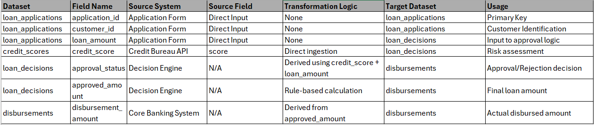
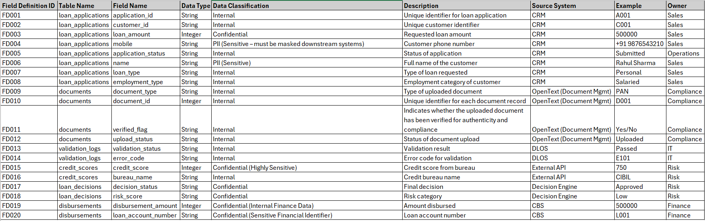
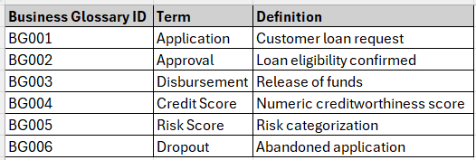
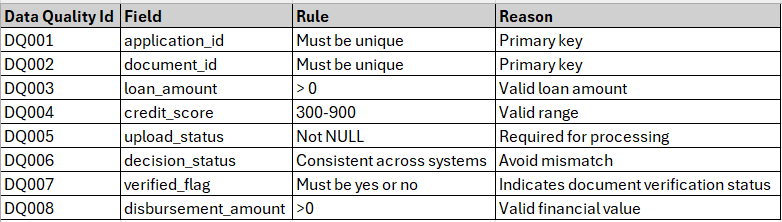
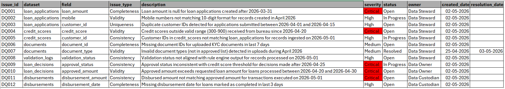

## Overview

This document captures selective field-level data lineage for critical fields involved in loan processing.

## Scope

* Focus on high-impact fields affecting credit decisioning and disbursement
* Each dataset originates from a unique source system
* Field-level lineage is maintained only for decision-critical attributes

---

## Data Origination Sources (Upstream Systems)

The following mapping defines the source system for each dataset:

| Dataset           | Upstream System           |
| ----------------- | ----------------------- |
| loan_applications | Application Form System |
| credit_scores     | Credit Bureau System    |
| documents         | Document Upload System  |
| validation_logs   | Validation Engine       |
| loan_decisions    | Decision Engine         |
| disbursements     | Core Banking System     |

---

# Data Lineage Mapping (Selective Field-Level)

## Lineage Table

This table captures field-level data lineage by identifying the originating source system (upstream) and how each field is consumed across downstream processes and datasets.

It ensures end-to-end traceability of critical data elements, supporting impact analysis, auditability, and data governance.

Lineage → shows flow

---

## Key Highlights

* Clear traceability from credit score → loan decision → disbursement
* Supports impact analysis and audit requirements
* Designed following enterprise data governance practices

---

# Supporting Data Governance Artifacts

## Data Dictionary (Field Definitions)
Data dictionary → defines fields

---

## Business Glossary
Glossary → defines business meaning

---

## Data Quality Rules
DQ rules → validate data

---

## Data Issue Lifecycle: Detect → Log → Assign → Fix → Validate → Close
Issue log → tracks failures and resolution

